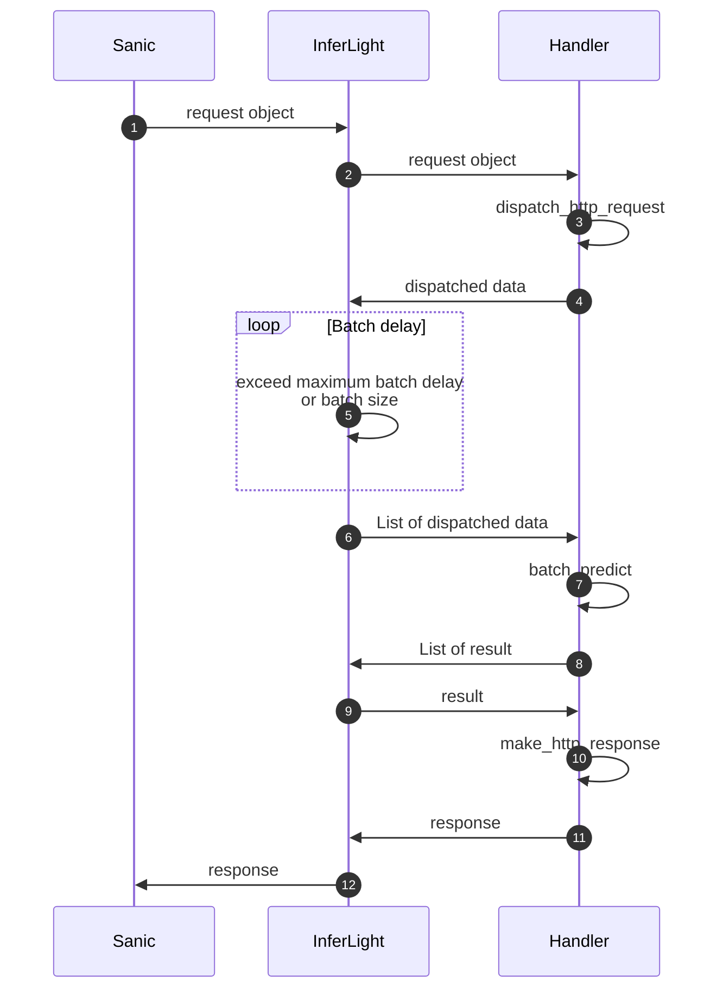

# InferLight

轻量级深度学习推理服务框架

### 数据流
#### Http


### 使用方法
使用方法可参考sample，主要包括几个部分：

- 定义模型及载入函数
- 定义预测函数
- 编写数据接收及结果返回代码

结束所有进程
```shell
ps -ef|grep inferlight|grep -v grep|cut -c 9-15|xargs kill -9
ps -ef|grep multiprocessing|grep -v grep|cut -c 9-15|xargs kill -9
```